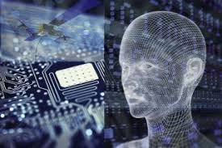

>>> Today at least a basic understanding of Computer Technology is necessary to function in this digital world. Computer technology is the design and construction of computers. Computer Technology includes harware and software of a computer system. Using this technology is called [computing](http://www.businessdictionary.com/definition/computing.html). IT or information technology, is a part of computer technology. There are many obvious jobs where understanding computer technology is necessary such as software developer, information security analyst and computer network architect. However, even accountants and human resource workers need this knowledge in order to perform their jobs. Computer technology can be extremely complex but will open up doors in a lot of industries if you cam master it. 

[HOME](index)
